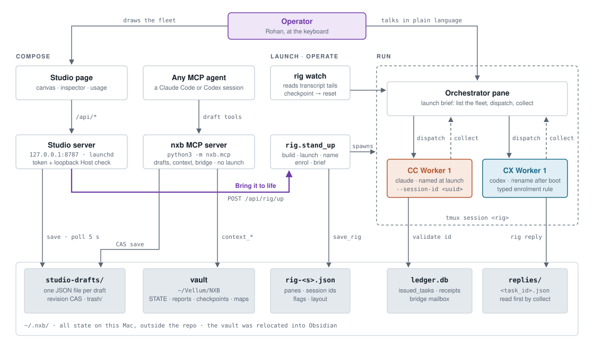
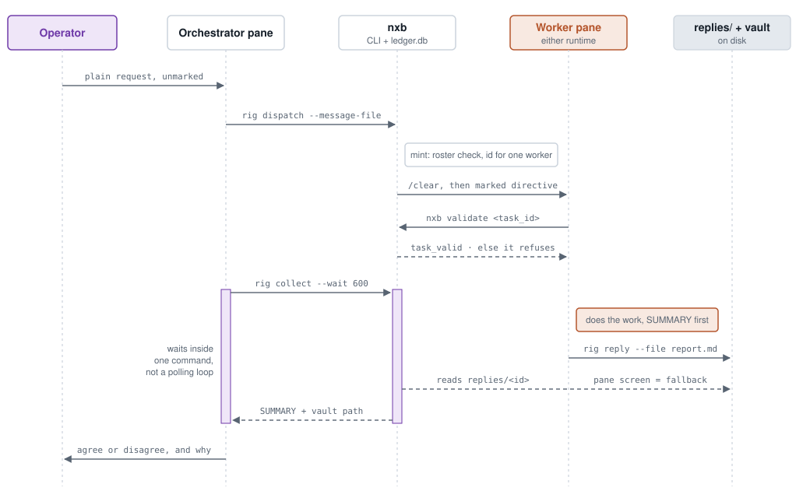
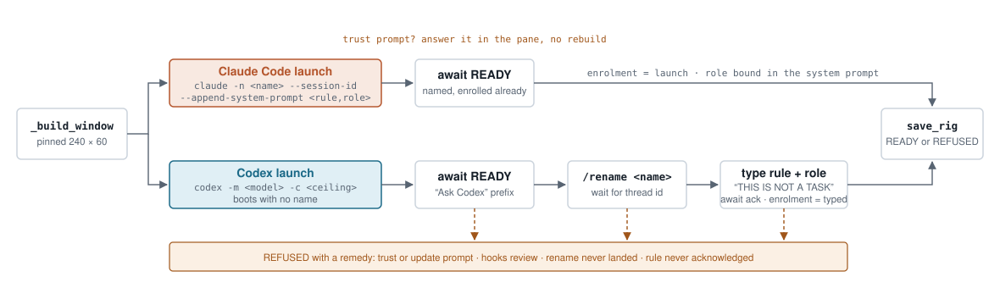
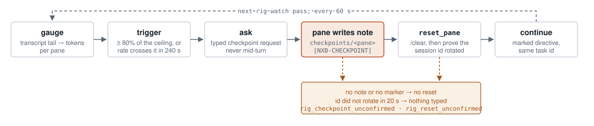

# nxb — compose a fleet of AI agents, then bring it to life in tmux

Draw the agents you want on a canvas. Press a button. They become real
terminal panes — named, enrolled and running — one per agent, each a live
Claude Code or Codex session you can watch and talk to.

The point is not throughput. It is **disagreement you can attribute**: an Opus
worker and a GPT worker reaching the same answer by different routes is
evidence; two instances of one model agreeing is variance.

## How it works

You draw a fleet of Claude Code and Codex agents on a canvas and press one button. Each agent becomes a named, enrolled tmux pane you can watch and type into. The Studio only designs fleets. The work happens in tmux, and a SQLite ledger plus a few folders under `~/.nxb` hold everything in between.

**Contents:** [The whole system](#the-whole-system) · [One task, end to end](#one-task-end-to-end) · [Bringing a pane to life](#bringing-a-pane-to-life-claude-and-codex-are-not-symmetric) · [Checkpoint, then reset](#keeping-context-bounded-checkpoint-then-reset) · [Four rules](#four-rules-the-design-holds-to) · [Where the state lives](#where-the-state-lives) · [Two agents, no rig](#two-agents-talking-no-rig-at-all) · [What it doesn't do](#what-it-deliberately-doesnt-do)

### The whole system

There are three planes. You **compose** a draft (by hand or through MCP), a person **launches** it, and the panes **run** it. All state lives on disk on this Mac, so any surface can pick up where another left off.

<picture>
  <source media="(prefers-color-scheme: dark)" srcset="docs/diagrams/system-map-dark.svg">
  
</picture>

*Key:* purple is a human decision · clay is a Claude Code pane · teal is a Codex pane · dashed arrows are return paths.

**Only one arrow launches anything: the purple one.** An MCP agent can put a complete fleet on the canvas in one call, and an open Studio picks it up within 5 seconds, but the draft tools can't stand up a rig. The broker isn't in the dispatch path either. A plain process can't type into a live pane (measured, nxb-047), so the orchestrator pane does the typing. nxb just issues task ids, records them, and refuses when something's wrong. Both runtimes validate and file replies the same way. The figure shows one of each to keep it readable.

### One task, end to end

This is what happens when you ask the orchestrator something like "ask CC Worker 1 and CX Worker 1 how many files are in ~/Documents, and tell me whether they agree." Here's one worker's path. The second worker runs the same path in parallel.

<picture>
  <source media="(prefers-color-scheme: dark)" srcset="docs/diagrams/task-lifecycle-dark.svg">
  
</picture>

**The task id is a permission slip.** Minting runs the roster check, and each id names exactly one worker. The worker validates the id itself by reading the ledger locally, so no extra messaging layer and no secret are needed. If an id was minted for a different worker, the worker refuses it. That prevents drift, not attack: nxb isn't a security boundary. Every automated line carries a marker, so anything you type without one is treated as you talking. `collect --wait` is there because in the 25-pane Pact run, orchestrators polling `collect` in a loop burned 633M tokens, 43% of all Codex input.

### Bringing a pane to life: Claude and Codex are not symmetric

Claude Code can be named and bound to its role on the command line. Codex boots with no name, so nxb has to name and enrol it by typing into the pane. That's why a Codex pane has three more ways to fail.

<picture>
  <source media="(prefers-color-scheme: dark)" srcset="docs/diagrams/pane-standup-dark.svg">
  
</picture>

**READY describes the rig, not the model.** It means every pane booted, was named, and was enrolled. It doesn't mean the agent inside can reach its model: a rig once came up READY while a worker sat on a 400 error. nxb never replaces a session it didn't create, so `rig up` refuses to clobber an existing tmux session of the same name. The role text says "THIS IS NOT A TASK" because in RIG-22, all 14 Codex panes treated a typed role as an order and started working on it.

### Keeping context bounded: checkpoint, then reset

Each pane launches with a context ceiling (100K by default, set per agent in the inspector). The watcher never resets a pane until it has proof that the pane saved its place.

<picture>
  <source media="(prefers-color-scheme: dark)" srcset="docs/diagrams/checkpoint-loop-dark.svg">
  
</picture>

**The trigger watches the rate as well as the level.** In one run, Builder 1 climbed from 43% to 102% of its ceiling between two passes, so a level-only threshold never fired in time (RIG-43). The watcher now also asks any pane that's rising fast enough to cross the ceiling within 240 seconds. The same rules keep costs down: per-task context (every dispatch starts from `/clear`), a core tool set for Claude panes (fixed context drops from about 43K to 23K tokens), and a STATE note that fresh workers read before they touch the repo.

### Four rules the design holds to

- **The operator owns the roster.** A worker is a pane that you created and named. If someone asks for a worker that doesn't exist, the broker refuses and explains how to create one. It never quietly spawns a substitute. The refusal is the feature.
- **Typing is the transport.** Directives reach both runtimes the same way: typed into the pane with `tmux`, and pasted through a buffer when they're over 600 bytes. That keeps vendor differences out of the dispatch path.
- **WAITING is not an answer.** From outside, a worker that's still working and a worker that refused look identical. So `collect` says it doesn't know. When a number can't be measured, it's reported as absent with a reason, never as zero.
- **Assumptions are measured.** nxb reads screens and depends on CLI flags, so a runtime update can quietly break it. `nxb doctor` re-checks each assumption and reports DRIFT when one no longer holds.

### Where the state lives

Nothing lives only in a browser tab or in an agent's context. After a reboot, `rig resume --session X --continue` rebuilds every pane from these files.

| Path | Holds | Written by |
|---|---|---|
| `~/.nxb/ledger.db` | issued task ids (who each one is for, and whether it's revoked), receipts, spawns, the bridge mailbox | mint, validate, revoke, bridge |
| `~/.nxb/studio-drafts/` | one JSON file per fleet design. Saves use compare-and-swap on a revision, and deletes go to `trash/`, so an agent can't overwrite a newer edit | Studio page, MCP draft tools |
| `~/.nxb/rig-<session>.json` | panes, runtimes, Claude session ids, Codex thread ids, flags, layout, peers, checkpoint stamps | stand_up, reset, relaunch, watch |
| `~/.nxb/replies/` | filed answers keyed by task id. `collect` reads these before it looks at the screen | rig reply (the worker) |
| the vault (`~/.nxb/vault`, or wherever `context relocate` moved it) | Obsidian markdown: `rigs/<s>/STATE` (at most 24K chars), reports, checkpoints, maps, an FTS5 index | orchestrator, collect, watcher, MCP context tools |
| `~/.nxb/studio.token` | the Studio's access token (mode 600), kept so the page can be pinned as an app | Studio server |

### Two agents talking, no rig at all

For work that fits in a single conversation, you can skip tmux. Any two MCP sessions on this Mac, such as a terminal Claude Code session and the Codex app, can join the `nxb` bridge under names and message each other. The mailbox is two tables in the same `ledger.db`. Each client spawns its own MCP server, and the shared file ties them together. `nxb_bridge_inbox` waits inside the tool call for up to 240 s, so a five-minute exchange takes a handful of calls instead of a polling loop. A message to a name nobody has joined under is refused, and the refusal lists who is there.

### What it deliberately doesn't do

- The Studio can't dispatch work. It designs fleets. Tasks are handed out in tmux, where you can see them.
- It isn't a security boundary. The worker's id check is the model following its own rule, and anything on the machine that can type counts as the operator.
- Agents run with permission prompts off. That's what makes a watched fleet usable, and it's why the Studio binds only to 127.0.0.1 and checks a token on every request.

<sub>Diagrams drawn from the code at `1f72fd5` (RIG-46): `nxb/studio.py`, `rig.py`, `tasks.py`, `studio_drafts.py`, `mcp.py`. Sources live in `docs/diagrams/`, one light and one dark SVG per figure.</sub>

---

## FOR THE AI AGENT READING THIS

You are setting this up for your operator. Work through the phases in order.

**Three rules, and they matter more than the steps:**

1. **Verify, never assume.** Every phase says how to check it worked. Run the
   check. This project exists because a document once claimed a capability
   that had been dead for two months and nothing was positioned to notice.
2. **Report what you observed, not that it passed.** If a step fails, say
   which one and paste the output. Do not work around it silently.
3. **Stop and ask** at any step marked **ASK**. Those spend the operator's
   money or launch processes on their machine.

---

### Phase 0 — check the ground

```sh
python3 --version                 # need 3.9+
tmux -V                           # required; the fleet lives in tmux
command -v claude || echo "NO CLAUDE"
command -v codex  || echo "NO CODEX"
```

**Interpret it:**
- No `python3` or no `tmux` → stop. Tell the operator: `brew install tmux`
  (macOS) or their package manager. Everything else waits on this.
- **At least one** of `claude` / `codex` is required. Both is better: with one
  runtime you have automation, with two you have cross-vendor checking, which
  is the reason this exists.
- There are **no third-party Python packages**. If you are reaching for `pip`,
  re-read this line.

### Phase 1 — put it on the path

```sh
export NXB_LEDGER="$HOME/.nxb/ledger.db"
export PYTHONPATH="/absolute/path/to/this/repo${PYTHONPATH:+:$PYTHONPATH}"
python3 -m nxb contract >/dev/null && echo "nxb is importable"
```

Append those two `export` lines to the operator's shell profile
(`~/.zshrc` or `~/.bashrc`) so they persist. Use the **absolute** path to
this clone.

`NXB_LEDGER` must be absolute and has **no default, deliberately**. A ledger
resolved against the current directory means two shells disagree about whether
a piece of work already happened. That was a real defect here.

**Check:** `python3 -m nxb contract` prints JSON. If it prints
`No module named nxb`, `PYTHONPATH` is wrong.

### Phase 2 — run the tests

```sh
PYTHONPATH= python3 -m pytest -m "not spawns_children" -q
```

Expect **400+ passed**. Note the leading `PYTHONPATH=` — it is not a typo. It
clears the variable for this command only, so `tests/` resolves to this
repo's own package.

If `pytest` is missing: `pip install pytest`. It is needed only for the tests,
never at runtime.

**A red suite here means stop and report.** Do not proceed to launch agents on
someone's machine with a failing suite.

### Phase 3 — the studio

Recommended on macOS — install it once as an always-on user service:

```sh
python3 -m nxb studio install
```

It starts at login, launchd restarts it after a crash, and the process no
longer occupies a terminal. The existing Studio token, drafts, and rigs are
preserved. Check or manage it with:

```sh
python3 -m nxb studio status
python3 -m nxb studio restart
python3 -m nxb studio uninstall   # preserves token, drafts, ledger, and logs
```

The foreground form remains useful for development or non-macOS hosts:

```sh
python3 -m nxb studio
```

It prints a URL carrying a token and opens a browser. Everything below can
also be done from the command line; the studio is the visual way.

**It is served from 127.0.0.1 and guarded**, because it launches agents with
permission prompts disabled: loopback bind only, a token required on every
request including the page load, a loopback-only `Host` check against DNS
rebinding, and constant-time comparison. **Never bind it to a network
interface.** The token persists in `~/.nxb/studio.token` (mode 600) so the
page can be pinned as an app; `--fresh-token` rotates it.

To make it a real app: open the URL in Safari → **File → Add to Dock**. On
Chrome or Brave, `python3 -m nxb studio --app` gives a chromeless window.

Studio drafts are durable files under `~/.nxb/studio-drafts/`, not private
browser state. The same NXB MCP server exposes catalog, validate, save, list,
get, and recoverable-delete tools, so **any MCP-speaking LLM can put a complete
workflow on the canvas in one tool call**. An open Studio imports those changes
within five seconds. Draft tools never launch agents; **Bring it to life stays
the operator's gate**.

### Phase 4 — **ASK** before the first fleet

Standing up a fleet launches real agent sessions that consume the operator's
plan quota. **Ask before doing it**, and ask what shape they want.

Then either compose it on the canvas and press **Bring it to life**, or:

```sh
python3 -m nxb rig up --session demo --orchestrator codex --workers cc:1,cx:1 --dir ~
```

`--workers` is `runtime:count` pairs — `cc` for Claude, `cx` for Codex.
`--orchestrator` takes either runtime, or `none`.

**Check it, and check it properly:**

```sh
python3 -m nxb rig workers --session demo    # every worker enrolled=true?
tmux attach -t demo                          # look at the panes
```

`READY` is a statement about the **rig** — that every pane booted, was named
and was enrolled. It says nothing about whether the agent inside can reach its
model. **Read the panes.** A rig came up READY here once while a worker sat on
a 400 for an unsupported model.

### Phase 4b — check the assumptions hold

```sh
python3 -m nxb doctor
```

Run this now, and again after any runtime update. nxb reads screens, parses
prose and passes flags, and a CLI release can void any of that silently.
`DRIFT` means an assumption no longer holds and a human should look at what
the runtime does now. `--deep` also boots each runtime to verify its readiness
marker and costs one Claude turn.

### Phase 5 — hand it work

Talk to the orchestrator pane in plain language:

> Ask CC Worker 1 and CX Worker 1 how many files are in ~/Documents, then tell
> me whether they agree.

It knows how to do the rest: it was given a brief at launch telling it how to
list its fleet, dispatch and collect. Underneath, each dispatch is two
commands you can also run yourself:

```sh
python3 -m nxb rig dispatch --worker "demo CC Worker 1" --message-file directive.md
python3 -m nxb rig collect  --worker "demo CC Worker 1" --task-id <id> --wait 600
```

`dispatch` mints the task id and types the directive in one step. `collect
--wait` waits **inside the command** and returns the moment the answer is
filed, so an orchestrator spends one model round-trip per ten minutes of
waiting instead of one per poll. That single habit was 43 percent of a
25-pane programme's token spend before it existed
(`docs/CONTEXT-BUDGET-nxb-079.md`). `mint` and `rig send` remain as the seam.

**Context is per task.** A dispatch starts the worker on a fresh context; the
filed reply and the repository carry the state between tasks. Pass
`--keep-context` only for a revision of the worker's last task. Every pane
also launches with a context ceiling (`context_limit` per agent in Studio;
100K by default; 0 disables).

### Phase 5b — peer rigs (one programme, several fleets)

A rig has one orchestrator. For a programme larger than one fleet, build
several rigs and name the others as **peers** of a hub rig (the `peers` box in
Studio's bar, or `--peers a,b` on `rig up`). The hub's orchestrator may then
dispatch to each peer's ORCHESTRATOR exactly as it dispatches to a worker,
with `--session <peer>`; a peer's workers stay that peer's. Leave `peers`
empty on the spokes so they can only answer, or two hubs can wait on each
other forever. Bring each rig to life separately; a peer that is not standing
is a mint refusal, and the hub asks you.

Any pane can FILE a long answer instead of relying on its screen:

```sh
python3 -m nxb rig reply --worker "demo CC Worker 1" --task-id <id> --file report.md
```

`collect` reads a filed answer first and whole, then falls back to the screen.
See `docs/PEER-RIGS-nxb-078.md`.

### Phase 5d — the context store

Every rig keeps one **state note** (`rigs/<session>/STATE`, at most 24,000
characters) that its orchestrator reads before dispatching and updates after
every collected task. When it exists, every directive tells the worker to
read it first, so a fresh worker orients from a few thousand tokens instead
of surveying the documents (measured at about 99K tokens per task before).
`collect` files any long answer as `reports/<id>` and returns the worker's
`SUMMARY:` paragraph plus the path; `search` returns snippets, never bodies.

```sh
python3 -m nxb context state  --session demo
python3 -m nxb context put    --key rigs/demo/STATE --file state.md
python3 -m nxb context search --query "scheduler tests"
python3 -m nxb context path                     # where the vault is
```

The vault is plain Obsidian-compatible markdown beside the ledger, with an
`NXB.base` dashboard (tasks, state notes, checkpoints, reports) written once.
Open that folder as a vault in Obsidian, or move it inside one of your
vaults with `python3 -m nxb context relocate --to ~/Vellum/NXB`. The same
operations exist as MCP tools (`nxb_context_*`), plus `patch` (one section)
and `map` (the project's map note, which the orchestrator has written first
when it is missing). `docs/CONTEXT-STORE-nxb-081.md` and
`docs/CHECKPOINTS-nxb-082.md` have what was explored and the projections.

**The floor.** A Claude rig pane launches with the core tools (Bash, Read,
Edit, Write, Glob, Grep): measured, that takes a pane's fixed context from
about 43K to about 23K tokens, paid on every request. Set `tools: all` on an
agent that needs more.

**Checkpoint, then reset.** Every pane launches with a 100K context ceiling.
Run the watcher per rig and a pane over 80% of its ceiling writes a bounded
checkpoint note to the vault, is reset onto it, and continues its task with
the same id; nothing is reset without a confirmed note.

```sh
python3 -m nxb rig watch --session demo --interval 60      # detached, per rig
python3 -m nxb rig health --session demo                    # context per pane
```

### Phase 5c — after the machine restarts

Rigs live in tmux and die with the host. Do **not** rebuild them:

```sh
python3 -m nxb rig resume --session demo --continue
```

Every pane reopens its own conversation (`codex resume <thread>`,
`claude --resume <session>`), the report names which panes hold unfinished
tasks, and `--continue` tells those panes to pick up where they were. Studio
shows a **resume** button on a downed rig. Nothing resumes at login by itself.

`python3 -m nxb rig health --session demo` is the read-only view of a rig:
alive, busy, blocked, and every unfiled task with its age. If a pane needs a
word, `rig nudge` types it with guards a script never had (never into a
mid-turn pane, never twice in an hour, never at a pane with no task).

### Phase 7 — two agents talking, no rig

For a task that fits in a conversation, two MCP-speaking agents on this
machine can talk through the nxb server directly. Both a Claude Code
terminal session and the Codex app already point their `nxb` MCP server at
the same ledger. Tell one:

> Join the nxb bridge as `claude-terminal`, send `codex-app` this question:
> "…", then wait in your inbox for the reply.

and the other:

> Join the nxb bridge as `codex-app`, wait in your inbox, answer whatever
> arrives by sending to the name it came from, then wait again.

The inbox **waits inside the tool call** (up to 240 s), so a five-minute
exchange costs a handful of tool calls rather than a polling loop. A send to a
name nobody joined under is refused and names who is there. From a shell:
`python3 -m nxb bridge join|peers|send|inbox|history`. Details and limits in
`docs/BRIDGE-nxb-080.md`. Sessions opened before the bridge existed see the
tools after a restart.

### Phase 6 — shut down

```sh
python3 -m nxb rig down --session demo
python3 -m nxb revoke --all      # optional: invalidate outstanding task ids
```

---

## HOW IT WORKS, IN FOUR IDEAS

**1. The operator owns the roster.** A worker is a pane the operator created
and named. Nothing else can add to that list. Ask for a worker that does not
exist and the broker **refuses** and tells you how to create one — it will
never quietly spawn a substitute. That refusal is the product, not an error
path.

**2. A task id is a permission slip.** Minting one runs the roster check, and
the id names exactly one worker. The worker validates its own id before acting
and refuses an id minted for somebody else. Names carry their rig
(`demo CC Worker 1`), so two fleets can hold a "CC Worker 1" and no slip can
reach the wrong one.

**3. Typing is the transport, for both runtimes.** nxb does not use Claude's
socket or `codex queue`. It types the directive into the pane, identically for
both, so the vendor asymmetry leaves the system instead of being patched
forever. Automated input carries a marker; **unmarked input is the operator
talking** and is treated normally, which is how you keep typing to your own
panes.

**4. Honest by construction.** `WAITING` is not an answer. A worker still
working and a worker that refused look identical from outside, so `collect`
returns the pane and says it does not know, rather than guessing. Where a
number cannot be obtained it is reported absent with the reason, never as
zero.

## WHAT IT DOES NOT DO

- **It does not dispatch work from the studio.** By design: the studio
  architects fleets, tmux is where work happens, and the human gate stays in
  front of the panes.
- **It is not a security boundary.** The worker-side check is a model
  following its own rule. It removes drift, not attack. Anything on the
  machine that can type is the operator as far as this is concerned.
- **Agents run with permission prompts disabled**, because that is what makes
  a watched fleet usable. Understand that before standing one up.

## LAYOUT

| path | what |
|---|---|
| `nxb/` | the broker: rig, roster, task ids, typing transport, studio server |
| `tests/` | 400+ tests; more test code than product code |
| `contract/` | the published contract, with tests asserting the code matches |
| `docs/OPERATOR-NOTE-nxb.md` | the human guide; **read this next** |
| `docs/CONTEXT-BUDGET-nxb-079.md` | why a fleet costs what it costs, measured, and the rules that follow |
| `docs/BRIDGE-nxb-080.md` | two MCP agents talking through nxb with no rig |
| `docs/CONTEXT-STORE-nxb-081.md` | the Obsidian-compatible context store: what was explored, the caps, the projections |
| `docs/CHECKPOINTS-nxb-082.md` | checkpoint then reset, map notes, the Obsidian dashboard, section patches |
| `HANDOFF.md` | ~90 sections of hard-won findings. A later section sometimes corrects an earlier one from hundreds of lines away, so search for a topic's other mentions before acting on any one of them |
| `FINDINGS.json` | every defect found, with an owner and what would close it |
| `ledger/LEDGER.md` | task history |

State lives outside the repo, in `~/.nxb/`: the ledger, Studio drafts, rig
records, launch briefs, saved personas and the usage cache.
